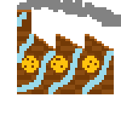

# Notre démarche
Groupe 1 (Guillaume, Felix, Matthieu, Étienne)

## Framework
Pour le cahier des charges du projet, il fallait choisir un framework qui facilite le travail en groupe et la rapidité du développement. Étant donné les competences de quelques membres du groupe, React a été privilégié, qui permet la factorisation de composantes et la séparation de code.
Pour le back-end, Next.js a été choisi pour la facilité de créer des API.
Au niveau de la base de données, nous avons choisi Superbase (gratuit pour les petits projets).

## Design
Nous avons voulu partir du design qui rappelle l'aspect pixelisé d'un jeu très connu, Minecraft. Pour cela, la police et les images sont pixellisés.
C'est Felix qui s'est occupé des couleurs et des images pour les upgrades.

  
  
  
  
  
  

## Back-end
Pour permettre la persistance de partie à travers de multiples appareils, un back-end efficace était obligatoire. Guillaume s'est occupé de la création de la base de données et de l'implémentation des API Supabase, tandis que Felix s'est occupé des API côté Next.js. Pour plus de sécurité, l'application client fait d'abord une requête vers le serveur Next.js qui lui communique avec Supabase.

## Algorithme
L'algorithme tourne en Javascript sur le navigateur, et s'occupe d'incrémenter les cookies, montrer les upgrades etc.

## Hackage
Pour le développement et pour permettre le hackage comme dans le vrai jeu, des fonctions sont appellables depuis la console:\
`window.cookies` contient le nombre de cookies du joueur et est modifiable\
`window.goldenCookies()` active la session "golden cookies"\
`window.showCookie()` montre le cookie flottant qui permet l'activation des "golden cookies"
